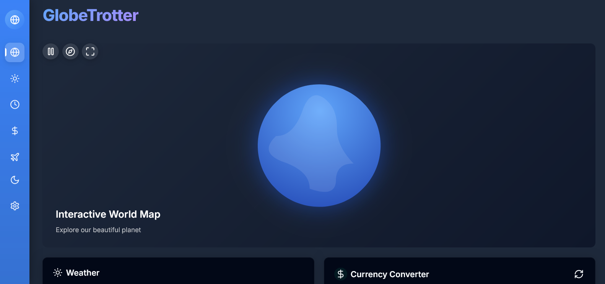

# GlobeTrotter Companion

A modern travel companion web application built with React, TypeScript, and Vite.



## Features

- **Interactive World Map**: Explore the globe with a 3D interactive map
- **Weather Widget**: Check weather conditions for any city
- **World Clock**: Track time across multiple timezones
- **Currency Converter**: Convert between major world currencies
- **Airport Map**: Find information about major international airports

## Tech Stack

- **Frontend**: React, TypeScript
- **Styling**: Custom CSS with CSS variables for theming
- **State Management**: React Hooks and Context
- **Routing**: React Router
- **Build Tool**: Vite

## Getting Started

### Prerequisites

- Node.js 16+ or Bun 1.0+
- API keys for the services mentioned below

### Installation

1. Clone the repository

```bash
git clone https://github.com/yosephdev/globe-trotter-companion.git
cd globe-trotter-companion
```

2. Install dependencies

```bash
npm install
# or
bun install
```

3. Create a `.env` file in the root directory with your API keys (see `.env.example`)

```
VITE_OPEN_WEATHER_API_KEY=your_openweathermap_api_key
VITE_GOOGLE_MAPS_API_KEY=your_google_maps_api_key
VITE_MAPBOX_ACCESS_TOKEN=your_mapbox_access_token
```

4. Start the development server

```bash
npm run dev
# or
bun dev
```

5. Open your browser and navigate to `http://localhost:3000`

## Building for Production

```bash
npm run build
# or
bun run build
```

The built files will be in the `dist` directory.

## Deployment

The app can be deployed to any static hosting service:

1. Build the project

```bash
npm run build
```

2. Deploy the `dist` directory to your hosting service

### Environment Variables

Make sure to set the following environment variables on your hosting platform:

- `VITE_OPEN_WEATHER_API_KEY`: API key for OpenWeatherMap
- `VITE_GOOGLE_MAPS_API_KEY`: API key for Google Maps
- `VITE_MAPBOX_ACCESS_TOKEN`: Access token for Mapbox

## Features to Add

- User authentication and profiles
- Trip planning and itinerary management
- Flight tracking
- Local attraction recommendations
- Language translation
- Offline mode support

## License

MIT

## Acknowledgements

- [React](https://reactjs.org/)
- [Vite](https://vitejs.dev/)
- [Lucide Icons](https://lucide.dev/)
- [OpenWeatherMap API](https://openweathermap.org/api)
- [Exchange Rate API](https://exchangerate.host/)
- [World Time API](http://worldtimeapi.org/)
